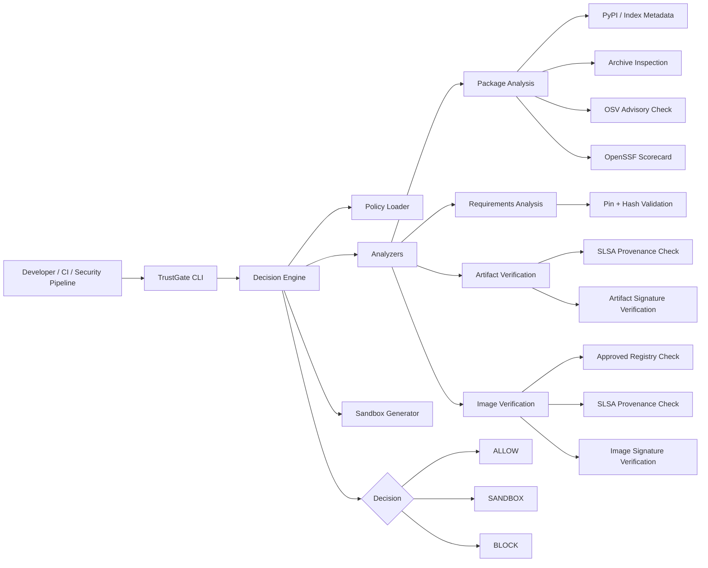
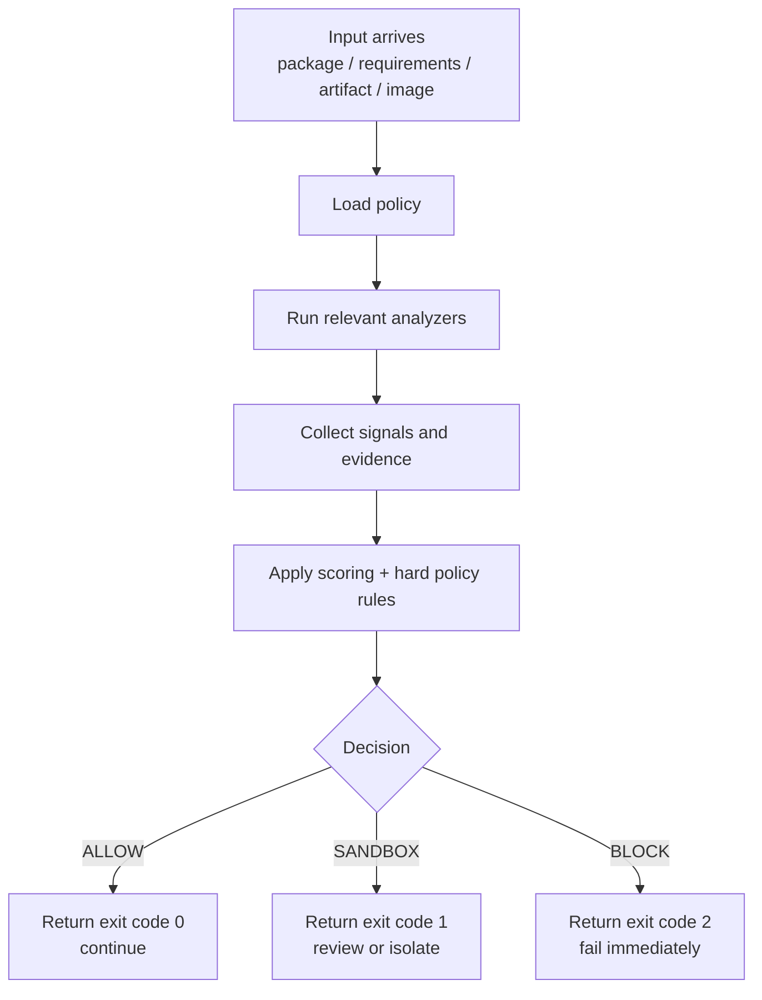

# TrustGate Enterprise

> **Zero-trust gatekeeping for open-source dependencies, build artifacts, and container images.**
>
> TrustGate decides whether software should be **allowed**, **sandboxed**, or **blocked** before it reaches developer machines, CI runners, internal mirrors, or production environments.

---

## Why TrustGate exists

Traditional scanners mostly answer one question:

**“Is this package known to be vulnerable?”**

That is not enough for modern software supply-chain risk.

TrustGate is built for a stricter question:

**“Should we trust this package, artifact, or image at all?”**

It enforces one core rule:

> **Nothing gets installed or promoted unless it is pinned, explainable, and aligned with enterprise policy.**

Depending on the stage, that can also mean:

- **Pinned** — exact versions only
- **Mirrored** — approved internal package or image source
- **Verified** — signatures and provenance pass policy
- **Explainable** — every decision includes findings and evidence
- **Traceable** — machine-readable `decision_trace` shows which rules matched and why

---

## What TrustGate does

TrustGate provides a single control point in front of:

- Python packages from PyPI-compatible indexes
- `requirements.txt` dependency sets
- local build artifacts such as wheels
- OCI / Docker container images

For each target, it collects signals, applies policy, and returns one of three decisions:

- **ALLOW** — acceptable under the active policy
- **SANDBOX** — not trusted enough for direct use; should run in isolation or go through review
- **BLOCK** — fail immediately

It is designed to work as:

- a local CLI
- a CI/CD gate
- an internal approval step before promotion or deployment

---

## Architecture overview



---

## Enterprise controls included

### Dependency discipline
- exact package version pin enforcement
- `requirements.txt` validation
- optional mandatory hash pin support for requirements

### Package trust analysis
- package metadata inspection
- release age policy checks
- yanked release detection
- package archive inspection
- startup-hook detection (`.pth`, `sitecustomize.py`, `usercustomize.py`)
- suspicious code-pattern detection
- native binary presence signal

### External trust signals
- OSV advisory lookup
- OpenSSF Scorecard signal with explainable weak-check evidence when available

### Enterprise supply-chain controls
- internal mirror policy enforcement
- approved container registry enforcement
- Sigstore / Cosign verification hooks for artifacts and images
- SLSA provenance validation hooks
- approved builder identity policy

### Isolation controls
- hardened Docker sandbox command generation
- non-root execution
- read-only filesystem
- dropped capabilities
- `no-new-privileges`
- network disabled by default

### CI/CD behavior
- strict exit codes
- policy-driven gate decisions
- automation-friendly CLI output

---

## Policy profiles

TrustGate works best with **different policy profiles for different stages** of the software lifecycle.

> Policy files are schema-validated and should declare `"policy_version": 1`.

### `policies/local_analysis_policy.json`
Use this for:

- developer workstations
- dependency triage
- local package review
- pre-approval investigation

Typical behavior:

- shows OSV findings
- shows Scorecard findings
- surfaces weak repository hygiene
- sandboxes on real package risk
- does **not** over-punish common packages based on weak Scorecard alone

### `policies/enterprise_policy.json`
Use this for:

- mirror ingestion
- CI/CD promotion
- signed artifact approval
- image promotion and deployment approval

Typical behavior:

- strict internal mirror enforcement
- strict approved registry enforcement
- Sigstore / Cosign verification
- SLSA provenance enforcement
- approved signer / issuer / builder controls

---

## Project structure

```text
Trustgate/
├── policies/
│   ├── enterprise_policy.json
│   └── local_analysis_policy.json
├── trustgate/
│   ├── analyzers.py
│   ├── cli.py
│   ├── engine.py
│   ├── models.py
│   ├── policy.py
│   ├── sandbox.py
│   └── utils.py
├── pyproject.toml
└── README.md
```

### Key files

- **`trustgate/cli.py`** — command-line entrypoint
- **`trustgate/engine.py`** — orchestrates checks and makes final decisions
- **`trustgate/analyzers.py`** — package, artifact, image, and external signal analyzers
- **`trustgate/policy.py`** — loads and applies policy
- **`trustgate/sandbox.py`** — generates hardened sandbox execution paths
- **`policies/enterprise_policy.json`** — strict enterprise enforcement policy
- **`policies/local_analysis_policy.json`** — practical local triage policy

---


## Testing

Run these checks for every code change to ensure TrustGate keeps working end-to-end:

```bash
python -m unittest discover -s tests -p "test_*.py" -v
python -m compileall trustgate
python -m trustgate.cli policy-show
python -m trustgate.cli analyze requests==2.32.3 --json --policy policies/local_analysis_policy.json
python -m trustgate.cli analyze-requirements requirements.txt --policy policies/local_analysis_policy.json
```

Recommended CI order:
1. Static sanity (`compileall`)
2. Unit tests (`unittest`)
3. CLI smoke tests (`policy-show`, `analyze`, `analyze-requirements`)

## Installation

### Basic

```bash
pip install .
```

### Using `uv`

```bash
git clone https://github.com/ashokkumar27/Trustgate.git
cd Trustgate

uv venv
source .venv/bin/activate
uv pip install -e .
```

Run without manually activating the environment:

```bash
uv run trustgate analyze requests==2.32.3 --policy policies/local_analysis_policy.json
```

### Recommended enterprise environment

Install on CI runners or controlled review hosts with:

- Python 3.11+
- Docker
- `cosign`
- access to your internal package mirror
- access to your internal image registry

For full enterprise use, TrustGate should sit in front of:

- developer dependency approval workflows
- mirror ingestion pipelines
- CI build promotion stages
- image promotion and deployment approval

---

## Quick start

### 1. Analyze a single package locally

```bash
trustgate analyze requests==2.32.3 --policy policies/local_analysis_policy.json
```

### 2. Analyze a package and produce sandbox guidance

```bash
trustgate analyze requests==2.32.3 \
  --policy policies/local_analysis_policy.json \
  --sandbox
```

### 3. Validate a requirements file

```bash
trustgate analyze-requirements requirements.txt \
  --policy policies/local_analysis_policy.json
```

### 4. Verify a built artifact

```bash
trustgate verify-artifact \
  --artifact dist/pkg.whl \
  --bundle dist/pkg.sigstore.json \
  --provenance dist/pkg.provenance.json \
  --policy policies/enterprise_policy.json
```

### 5. Verify a container image

```bash
trustgate verify-image \
  --image registry.company.internal/team/app:1.2.3 \
  --provenance provenance.json \
  --policy policies/enterprise_policy.json
```

### 6. Show the active built-in policy

```bash
trustgate policy-show
```

---

## Exit codes

TrustGate is CI-friendly by design.

- **`0`** — allow
- **`1`** — sandbox
- **`2`** — block

This makes pipeline behavior straightforward:

- continue on `0`
- divert to isolated review on `1`
- fail the pipeline on `2`

---

## Decision flow



### Decision philosophy

- **ALLOW** means the target is acceptable under the current policy
- **SANDBOX** means it is not safe enough for direct use, but may still be worth isolated review
- **BLOCK** means it violates hard policy or crosses hard-risk boundaries

In practice:

- local analysis mode can show warnings without forcing sandbox on weak repository posture alone
- enterprise enforcement mode can apply stricter signature, provenance, mirror, and registry rules

---

## How it works

### 1. Policy is loaded first
TrustGate starts by loading the selected policy JSON.

The policy defines what your organization considers acceptable, including:

- whether exact pins are required
- whether public registries are allowed
- whether signatures are mandatory
- whether provenance is required
- which builders are trusted
- how fresh a release may be

This keeps TrustGate deterministic. It is not guessing. It is applying rules.

### 2. Signals are collected
Depending on the command, TrustGate inspects:

- package metadata
- package archive contents
- requirement lines and hashes
- advisory feeds
- repository trust posture
- signatures and provenance
- registry and mirror compliance

### 3. Risk is scored
Each issue contributes to risk.

Examples:

- startup hooks are critical
- very fresh releases are risky
- weak repository posture lowers trust
- missing signatures or provenance can hard-fail under strict enterprise policy
- known advisories can trigger sandbox review

### 4. A final decision is made
TrustGate returns:

- **ALLOW** if policy and risk checks pass
- **SANDBOX** if the target is not safe enough for direct use but not an immediate hard stop
- **BLOCK** if the target violates policy or crosses hard-risk thresholds

---

## Core command behavior

### `trustgate analyze`
Use this to evaluate a single pinned Python package.

It checks:

- exact version pin
- release metadata
- release freshness
- yanked status
- archive contents
- startup hooks
- suspicious code patterns
- native binaries
- OSV advisories
- OpenSSF Scorecard signals

Typical use:

```bash
trustgate analyze litellm==1.82.6 --policy policies/local_analysis_policy.json
```

> `analyze` is for package trust analysis.  
> Signature and provenance enforcement belong to `verify-artifact` and `verify-image`.

---

### `trustgate analyze-requirements`
Use this to validate a dependency set before installation or promotion.

It checks:

- exact version pins
- line validity
- optional hash requirements

Typical use:

```bash
trustgate analyze-requirements requirements.txt --policy policies/local_analysis_policy.json
```

This command is useful for pull requests, dependency updates, and mirror ingestion workflows.

---

### `trustgate verify-artifact`
Use this when a wheel or other build artifact is ready for approval or promotion.

It checks:

- artifact existence
- Sigstore / Cosign verification
- expected signer identity
- expected issuer
- provenance presence
- approved SLSA builder identity

Typical use:

```bash
trustgate verify-artifact \
  --artifact dist/pkg.whl \
  --bundle dist/pkg.sigstore.json \
  --provenance dist/pkg.provenance.json \
  --policy policies/enterprise_policy.json
```

---

### `trustgate verify-image`
Use this before promoting or deploying a container image.

It checks:

- approved registry rules
- Cosign verification
- provenance presence
- approved builder identity

Typical use:

```bash
trustgate verify-image \
  --image registry.company.internal/team/app:1.2.3 \
  --provenance provenance.json \
  --policy policies/enterprise_policy.json
```

---

## Scorecard behavior

TrustGate uses public OpenSSF Scorecard data when available.

Typical behavior:

- weak repository hygiene is surfaced as explainable findings
- especially weak checks such as branch protection, token permissions, or code review can be highlighted
- unavailable public Scorecard data should not automatically look like a hard error
- in local analysis mode, weak Scorecard posture can remain visible without forcing sandbox on its own
- in enterprise workflows, you can choose stricter enforcement through policy

This makes Scorecard a useful trust signal without turning it into a noisy blocker.

---

## Sandbox mode

When TrustGate decides a target should not be used directly but does not require a hard block, it can generate a hardened Docker sandbox path.

The sandbox model is intentionally restrictive:

- non-root user
- read-only root filesystem
- `tmpfs` for temporary files
- dropped capabilities
- `no-new-privileges`
- CPU and memory limits
- process limits
- network disabled by default

This supports a simple operating model:

> **Untrusted or uncertain software should never run on real developer hosts or privileged CI runners.**

---

## Policy model

Policy is the heart of TrustGate.

A typical policy can control:

- exact pin requirements
- hash requirements for requirements files
- whether internal mirrors are mandatory
- approved package hosts
- approved image registries
- how recent a release may be before sandboxing or blocking
- whether startup hooks are forbidden
- whether Sigstore verification is mandatory
- whether SLSA provenance is mandatory
- approved signer identities
- approved OIDC issuers
- approved builder identities
- minimum Scorecard expectations

### Why policy matters

Without policy, a scanner only reports findings.  
With policy, TrustGate becomes an enforcement point.

That is the difference between **security visibility** and **security control**.

---

## Recommended enterprise workflow

### Option A — dependency intake gate
1. developer proposes a new dependency
2. CI runs `trustgate analyze-requirements`
3. CI runs `trustgate analyze` on each pinned dependency
4. anything risky is blocked or diverted to sandbox review
5. approved packages are ingested into the internal mirror

### Option B — artifact promotion gate
1. package or artifact is built
2. build pipeline signs the artifact and emits provenance
3. CI runs `trustgate verify-artifact`
4. only verified artifacts are promoted

### Option C — image promotion gate
1. image is built and signed
2. provenance is attached
3. CI runs `trustgate verify-image`
4. only verified images from approved registries are deployed

---

## Example CI behavior

### Allow
A pinned package has no hard-risk findings and is acceptable under the current policy.

Pipeline action:
- continue

### Sandbox
A package is pinned but has known advisories, is very recently published, or contains other review-worthy signals.

Pipeline action:
- do not use directly
- route to isolated review or controlled detonation environment

### Block
A package includes startup hooks, fails signature checks, lacks required provenance, or violates mirror / registry policy.

Pipeline action:
- fail immediately

---

## Security design principles

TrustGate is built around these principles:

### 1. Zero-trust by default
Do not assume packages, artifacts, images, or even scanners are safe.

### 2. Policy before convenience
Pinning, provenance, and trust rules come before installation speed.

### 3. Explainable decisions
Every decision should be reviewable and defensible.

### 4. Isolation for uncertainty
If something is not safe enough to trust, it belongs in a sandbox.

### 5. Promotion is a security event
Artifacts and images should be verified before they move deeper into the enterprise.

---

## What TrustGate does not pretend to do

TrustGate is a strong gate, but it is not magic.

It does **not** replace:

- an internal package mirror
- a signing pipeline
- provenance generation in CI
- endpoint security
- runtime detection
- deep malware detonation labs
- network egress controls
- broader software supply-chain governance

It is best used as a front-door control inside a larger security program.

---

## Production recommendations

For serious enterprise rollout, pair TrustGate with:

- an internal PyPI-compatible mirror
- an internal OCI image registry
- artifact signing during build or ingestion
- provenance generation in CI
- approved builder identity controls
- network egress controls on CI runners and sandbox hosts
- separate review infrastructure for sandbox execution
- branch protection and release controls on internal build systems

---

## External tooling required for full verification

Install these on systems that will perform verification:

- **`cosign`** for artifact and image verification
- **Docker** for sandbox workflows

You should also provide:

- internal package mirror URL
- internal registry URL
- approved signer identities
- approved OIDC issuer values
- approved SLSA builder identities

---

## Positioning for leadership

**TrustGate Enterprise is an approval and quarantine layer for open-source software.**

It helps prevent risky dependencies, artifacts, and images from being installed or promoted unless they satisfy enterprise policy around pinning, signatures, provenance, repository posture, and explainable trust signals.

---

## Roadmap ideas

- deeper behavioral detonation in sandbox
- private advisory sources
- SBOM generation and attestation validation
- policy exceptions with approval workflow
- Slack / Teams / PR-comment reporting
- central service mode with audit logs
- package-to-package version diffing
- release anomaly detection across trusted baselines

---

## License and internal usage

This repository is intended as an enterprise control-plane starter for internal open-source risk governance.

Adopt, extend, and harden it to match your organization’s policy and infrastructure.

---

## Final summary

TrustGate Enterprise is a **policy-enforced gate** that helps organizations decide whether software should be trusted before it is installed, promoted, or deployed.

It is strict by design.

That is the point.
